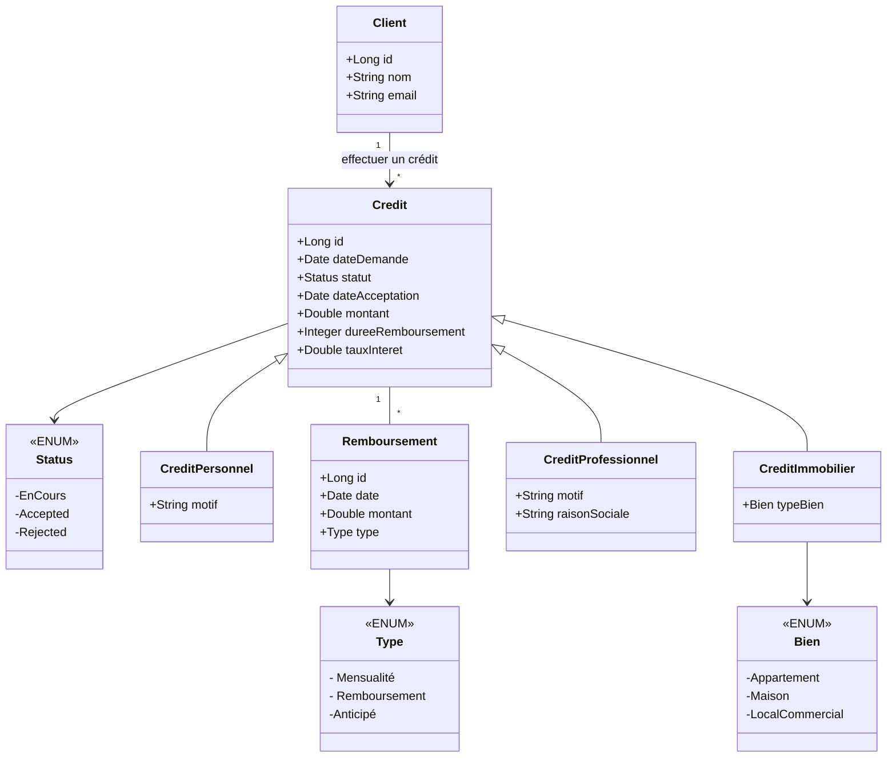

### Digrame de classe

```mermaid
classDiagram
    class Client {
        +Long id
        +String nom
        +String email
    }

    class Credit {
        +Long id
        +Date dateDemande
        +Status statut
        +Date dateAcceptation
        +Double montant
        +Integer dureeRemboursement
        +Double tauxInteret
    }

    Credit --> Status

    class Status {
        <<ENUM>>
        -EnCours
        -Accepted
        -Rejected
    }

    class CreditPersonnel {
        +String motif
    }

    class CreditImmobilier {
        +Bien typeBien
    }

    CreditImmobilier --> Bien

    class Bien {
        <<ENUM>>
        -Appartement
        -Maison
        -LocalCommercial
    }


    class CreditProfessionnel {
        +String motif
        +String raisonSociale
    }

    class Remboursement {
        +Long id
        +Date date
        +Double montant
        +Type type
    }

        Remboursement --> Type

    class Type {
        <<ENUM>>
        - Mensualité
        - Remboursement
        -Anticipé
    }


    Client "1" --> "*" Credit : effectuer un crédit

    Credit "1" -- "*" Remboursement
    Credit <|-- CreditPersonnel
    Credit <|-- CreditImmobilier
    Credit <|-- CreditProfessionnel
```
