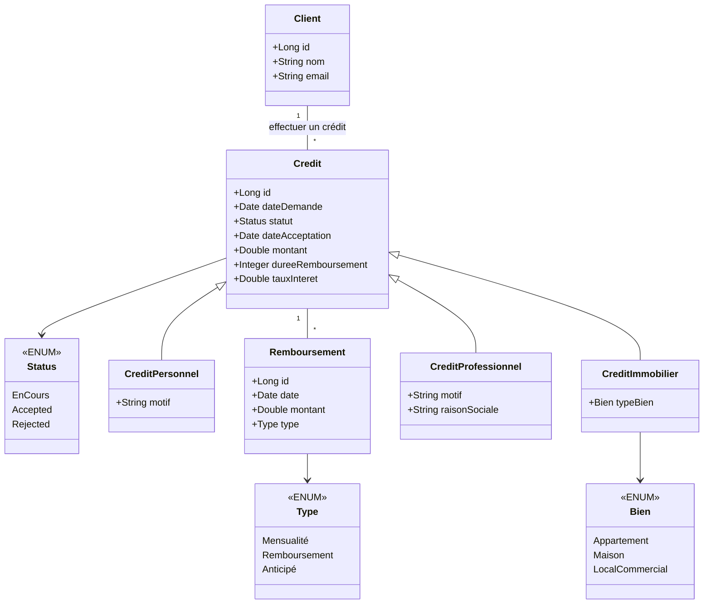
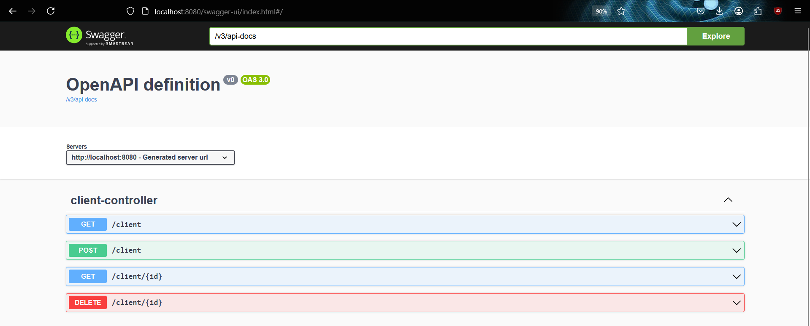

# Rapport Exam JEE

## Conception

### Architecture du projet

### Digramme de class




## Couche DAO
### Entités JPA

```java
@Data
@Entity
@AllArgsConstructor
@NoArgsConstructor
@Builder
public class Client {
    @Id
    @GeneratedValue(strategy = GenerationType.AUTO)
    private Long id;
    private String nom;
    private String email;

    @OneToMany(mappedBy = "client")
    @Builder.Default
    private List<Credit> credits = new ArrayList<>();
}
```

```java
@Data
@Entity
@AllArgsConstructor
@NoArgsConstructor
@Inheritance(strategy = InheritanceType.SINGLE_TABLE)
@DiscriminatorColumn(name = "type", discriminatorType = DiscriminatorType.STRING, length = 20)
public abstract class Credit {
    @Id
    @GeneratedValue(strategy = GenerationType.AUTO)
    private Long id;
    private Date dateDemande;
    @Enumerated(EnumType.STRING)
    private Status statut;
    private Date dateAcceptation;
    private Double montant;
    private Integer dureeRemboursement;
    private Double tauxInteret;

    @ManyToOne
    private Client client;

    @OneToMany(mappedBy = "credit")
    private List<Remboursement> remboursements = new ArrayList<>();
}
```

```java
@Data
@Entity
@AllArgsConstructor
@NoArgsConstructor
@Builder
public class Remboursement {
    @Id
    @GeneratedValue(strategy = GenerationType.AUTO)
    private Long id;
    private Date date;
    private Double montant;
    private Type type;

    @ManyToOne
    private Credit credit;
}
```

```java
@Data
@Entity
@AllArgsConstructor
@NoArgsConstructor
@Builder
@DiscriminatorValue("CreditImmobilier")
public class CreditImmobilier extends Credit {
    @Enumerated(EnumType.STRING)
    private Bien typeBien;
}
```

```java
@Data
@Entity
@AllArgsConstructor
@NoArgsConstructor
@Builder
@DiscriminatorValue("CreditProfessionnel")
public class CreditProfessionnel extends Credit {
    private String motif;
    private String raisonSociale;
}
```

```java
@Data
@Entity
@AllArgsConstructor
@NoArgsConstructor
@Builder
@DiscriminatorValue("CreditPersonnel")
public class CreditPersonnel extends Credit {
    private String motif;
}
```
### Interface JPA

```java
public interface ClientRepository extends JpaRepository<Client, Long> {

}
```

```java
public interface CreditRepository extends JpaRepository<Credit, Long> {
}
```

```java
public interface CreditPersonnelRepository extends JpaRepository<CreditPersonnel, Long> {
}
```

```java
public interface CreditProfessionnelRepository extends JpaRepository<CreditProfessionnel, Long> {
}
```

```java
public interface CreditImmobilierRepository extends JpaRepository<CreditImmobilier, Long> {
}
```

```java
public interface RemboursementRepository extends JpaRepository<Remboursement, Long> {
}
```

## Couche Service
### DTO

```java
@Data
public abstract class CreditDTO {
    private Long id;
    private Date dateDemande;
    private Status statut;
    private Date dateAcceptation;
    private Double montant;
    private Integer dureeRemboursement;
    private Double tauxInteret;

    private List<RemboursementDTO> remboursements;
}
```

```java
@Data
@Builder
public class ClientDTO {
    private Long id;
    private String nom;
    private String email;

    private List<CreditDTO> credits;
}
```

```java
@Data
@Builder
public class RemboursementDTO {
    private Long id;
    private Date date;
    private Double montant;
    private Type type;
}
```

```java
@Data
@Builder
public class CreditPersonnelDTO extends CreditDTO {
    private String motif;
}
```

```java
@Data
@Builder
public class CreditImmobilierDTO extends CreditDTO {
    private Bien typeBien;
}
```

```java
@Data
@Builder
public class CreditProfessionelDTO extends CreditDTO {
    private String motif;
    private String raisonSociale;
}
```

### Mappers

```java
@Mapper(componentModel = "spring", uses = {RemboursementMapper.class})
public interface CreditMapper {
    @Mapping(target = "remboursements", source = "remboursements")
    CreditDTO toDTO(Credit credit);
    // @Mapping(target = "remboursements", ignore = true)
    // Credit toEntity(CreditDTO creditDTO);
}
```

```java
@Mapper(componentModel = "spring", uses = {CreditMapper.class})
public interface ClientMapper {
    @Mapping(target = "creditsDtos", source = "credits")
    ClientDTO toDTO(Client client);
    
    @Mapping(target = "credits", ignore = true)
    Client toEntity(ClientDTO clientDTO);
}
```

```java
@Mapper(componentModel = "spring")
public interface RemboursementMapper {
    RemboursementDTO toDTO(Remboursement remboursement);
    Remboursement toEntity(RemboursementDTO remboursementDTO);
}
```

```java
@Mapper(componentModel = "spring")
public interface CreditImmobilierMapper {
    // @Mapping(target = "remboursements", ignore = true)
    CreditImmobilierDTO toDTO(CreditImmobilier creditImmobilier);
    CreditImmobilier toEntity(CreditImmobilierDTO creditImmobilierDTO);
}
```

## REST Controllers

```java
@RestController
@RequestMapping("/client")
@AllArgsConstructor
@CrossOrigin("*")
public class ClientController {

    private ClientService clientService;

    @GetMapping
    public List<ClientDTO> findAll() {
        return clientService.findAll();
    }

    @GetMapping("/{id}")
    public ClientDTO findById(@PathVariable Long id) {
        return clientService.findById(id);
    }

    @PostMapping
    public ClientDTO save(@RequestBody ClientDTO clientDTO) {
        return clientService.save(clientDTO);
    }

    @DeleteMapping("/{id}")
    public void delete(@PathVariable Long id) {
        clientService.delete(id);
    }
    
}

```


### Swagger

#### Client
